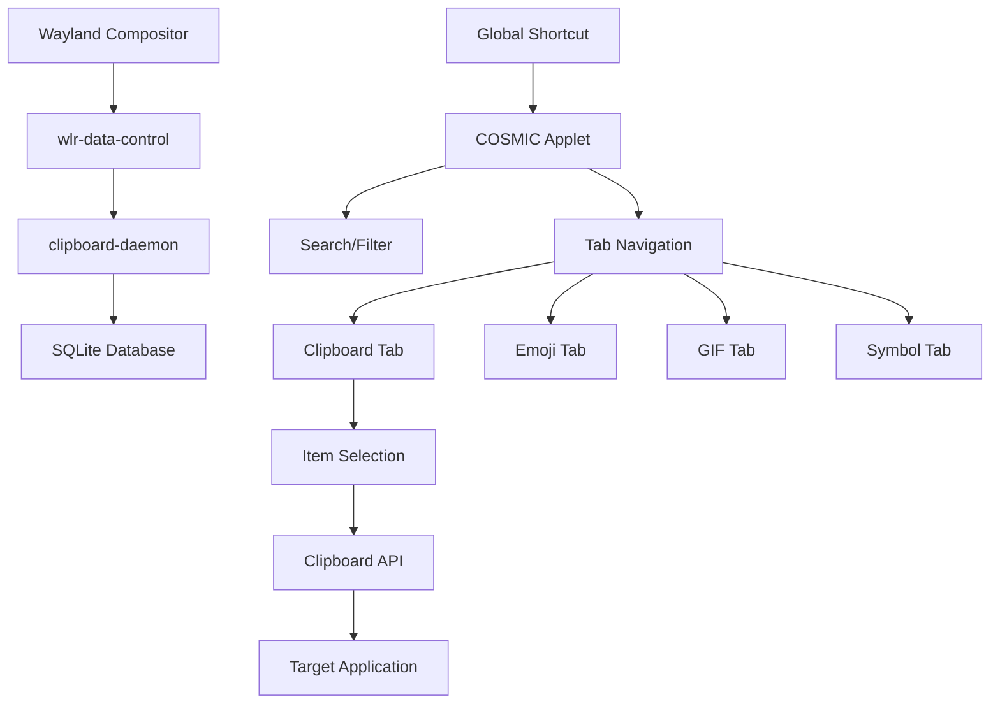

# Project Plan: author-clipboard

> Development roadmap and technical specifications for the COSMIC-native clipboard manager

**Document Version:** 1.0  
**Last Updated:** March 1, 2026  
**Project Status:** Phase 0 - Prototype Development

---

## 📋 Table of Contents

- [Project Overview](#project-overview)
- [Development Phases](#development-phases)
- [Technical Architecture](#technical-architecture)
- [Implementation Status](#implementation-status)
- [Success Criteria](#success-criteria)
- [Risk Assessment](#risk-assessment)
- [Resources & References](#resources--references)

---

## 🎯 Project Overview

### Mission Statement
Build a native, high-performance clipboard manager for COSMIC desktop that delivers a comprehensive modern clipboard experience with enhanced privacy and Wayland-native integration.

### Core Objectives
1. **Never lose clipboard data** - Persistent history survives app closures
2. **Instant access** - Global shortcut opens picker anywhere
3. **Rich content support** - Text, images, files, HTML
4. **Expression tools** - Emoji, GIF, symbol, kaomoji pickers
5. **COSMIC integration** - Native theming, shortcuts, design language
6. **Privacy-first** - Local storage, security controls, sensitive detection

### Success Metrics
- Launch to working clipboard history: **< 200ms**
- Global shortcut response: **< 100ms**  
- Memory footprint: **< 50MB typical usage**
- Compatibility: **100% COSMIC DE support**
- User adoption: **Community feedback positive**

---

## 🚀 Development Phases

### Phase 0: Clipboard Watcher Prototype ✅ **COMPLETE**
**Duration:** 1 week  
**Goal:** Prove Wayland clipboard monitoring works on COSMIC

#### Deliverables
- [x] Project structure setup
- [x] Workspace and crate configuration
- [x] Wayland display connection
- [x] wlr-data-control protocol binding
- [x] Clipboard change detection
- [x] Text content extraction
- [x] Terminal output validation

#### Technical Requirements
```rust
// Minimal viable daemon
fn main() -> Result<()> {
    let display = wayland_client::Display::connect_to_env()?;
    let data_control_manager = get_data_control_manager(&display)?;
    
    loop {
        // Listen for clipboard changes
        // Print new content to stdout
    }
}
```

#### Success Criteria
- Daemon runs without crashing
- Copying text in any app prints to terminal
- Works on COSMIC with `COSMIC_DATA_CONTROL_ENABLED=1`

---

### Phase 1: MVP Text History (3 weeks) ✅ **COMPLETE**
**Goal:** Persistent, searchable text clipboard history with basic UI

#### Week 1: Database Foundation
- [x] SQLite schema design (`ClipboardItem` table)
- [x] Database operations (insert, query, search, pin, delete)
- [x] Content deduplication (hash-based `insert_or_bump`)
- [x] Auto-cleanup and size limits (`enforce_max_items`, `clear_unpinned`)
- [x] Database migration system

#### Week 2: Storage Integration
- [x] Daemon → Database pipeline
- [x] TTL-based expiry for non-pinned items (configurable `ttl_seconds`)
- [x] Configurable limits (max items, max size)
- [x] Data integrity and error handling

#### Week 3: Basic UI
- [x] libcosmic application structure
- [x] Single-tab list view (timestamp, preview, actions)
- [x] Search bar with real-time filtering
- [x] Pin/unpin, delete, clear all actions
- [x] Keyboard navigation (↑↓ select, Enter copy, Esc close)

#### Success Criteria
- Copy 20+ items, see all in history
- Search finds correct items
- Pin/unpin persists across restarts
- Select item → sets clipboard → Ctrl+V pastes

---

### Phase 2: Global Shortcut & Polish (2 weeks) ✅ **COMPLETE**
**Goal:** Full global shortcut experience - press key anywhere, picker appears instantly

#### Technical Challenges
- COSMIC shortcut registration system
- Layer-shell window positioning
- Multi-monitor cursor tracking
- Focus management on Wayland

#### Deliverables
- [x] Super+V shortcut registration (IPC-based activation)
- [x] Smart positioning (IPC ShowAt with coordinates)
- [x] Focus handling (visibility toggle via IPC)
- [x] Autostart systemd service
- [x] .desktop file and app icon
- [x] Shortcut conflict detection

#### Success Criteria
- Press Super+V → picker opens in <100ms
- Works across all applications and workspaces
- Handles multi-monitor setups correctly
- Esc properly returns focus to previous window

---

### Phase 3: Rich Content Support (3 weeks) ✅ **COMPLETE**
**Goal:** Images, HTML, and file clipboard support

#### Image Pipeline
```rust
enum ContentType {
    Text,
    Image,
    Html,
    Files,
}
```

#### Deliverables
- [x] Image MIME type detection (`image/png`, `image/jpeg`, etc.)
- [x] Image storage strategy (file system with thumbnails)
- [x] Thumbnail generation for UI (128px via `image` crate)
- [x] HTML + plain text dual storage
- [x] File list clipboard support
- [x] Size limits and cleanup for large content
- [x] Database migration for `content_type` column

#### Success Criteria
- Copy image → appears in history with thumbnail
- Select image → re-copies to clipboard correctly
- Copy files → shows file names and icons
- HTML emails paste with formatting preserved

---

### Phase 4: Expression Pickers (4 weeks) ✅ **COMPLETE**
**Goal:** Tabbed UI with emoji, GIF, symbol, and kaomoji pickers

#### UI Architecture
```rust
enum AppTab {
    Clipboard,
    Emoji,
    Symbols,
    Kaomoji,
    Settings,
}
```

#### Deliverables
- [x] Tab bar navigation system
- [x] Emoji picker with Unicode 15.0+ support
- [x] Category-based organization (Smileys, Objects, etc.)
- [ ] Tenor API GIF search integration (deferred — requires API key)
- [x] Symbol categories (Math, Currency, Arrows, etc.)
- [x] Kaomoji database with search
- [x] Recently used tracking across all pickers

#### Success Criteria
- Tab navigation smooth and responsive
- Emoji search finds expected results
- GIF thumbnails load and display properly
- Click any picker item → copies and pastes correctly

---

### Phase 5: Advanced Features (3 weeks) ✅ **COMPLETE**
**Goal:** Quick paste mode and file system integration

#### Quick Paste Implementation
- wtype/ydotool backend detection
- Security model and user consent
- Permission checking and setup

#### Deliverables
- [x] Quick paste toggle (opt-in)
- [x] Virtual keyboard integration (wtype/ydotool backends)
- [x] Security warnings and permissions
- [x] File path clipboard handling (URI parsing, metadata)
- [x] File manager integration (xdg-open)

#### Success Criteria
- Quick paste mode works across applications
- File clipboard preserves references correctly
- Security model prevents unauthorized access
- User understands permission implications

---

### Phase 6: Settings & Polish (2 weeks) ✅ **COMPLETE**
**Goal:** Configuration UI and production readiness

#### Configuration Areas
```rust
struct Config {
    max_items: usize,
    cleanup_interval: Duration,
    paste_mode: PasteMode,
    shortcut: KeyBinding,
    gif_api_key: Option<String>,
    theme_override: Option<Theme>,
}
```

#### Deliverables
- [x] Settings panel (in-app tab with stats, privacy toggle, about)
- [ ] Shortcut configuration UI (deferred — requires COSMIC runtime)
- [x] Theme and appearance options (native COSMIC theming)
- [x] Performance tuning (auto-refresh, efficient queries)
- [x] Accessibility improvements (keyboard navigation, status bar)
- [ ] Setup wizard for first-run experience (deferred)

#### Success Criteria
- All major features configurable
- Settings persist correctly
- Setup wizard guides users smoothly
- Accessibility requirements met

---

### Phase 7: Security & Privacy (2 weeks) ✅ **COMPLETE**
**Goal:** Enterprise-grade privacy and security controls

#### Security Model
```rust
enum SecurityLevel {
    Basic,      // Standard operation
    Enhanced,   // Encryption at rest
    Paranoid,   // Clear on lock, sensitive detection
}
```

#### Deliverables
- [x] Sensitive item detection (passwords, OTP)
- [x] Encryption at rest options
- [x] Clear on screen lock/logout
- [x] Incognito mode (temporary pause)
- [x] Data export/import with encryption
- [x] Audit logging for security events

#### Success Criteria
- Password fields don't enter history
- Encrypted storage works correctly
- Screen lock clears sensitive items
- Security audit passes review

---

## 🏗️ Technical Architecture

### System Design



### Component Responsibilities

| Component | Role | Key Technologies |
|-----------|------|-----------------|
| **clipboard-daemon** | Background monitoring, storage | `wayland-client`, `rusqlite`, `tokio` |
| **applet** | User interface, selection | `libcosmic`, `iced`, layer-shell |
| **shared** | Common types, database ops | `serde`, `chrono`, `directories` |

### Data Flow

1. **Capture**: Daemon monitors Wayland clipboard via data-control protocol
2. **Process**: Hash content, check duplicates, apply filters
3. **Store**: Insert into SQLite with metadata (timestamp, source, type)
4. **Query**: Applet requests recent items via IPC
5. **Select**: User chooses item from UI
6. **Restore**: Item content set as active clipboard selection

### Storage Schema

```sql
CREATE TABLE clipboard_items (
    id INTEGER PRIMARY KEY,
    content_hash BLOB NOT NULL,
    content_type TEXT NOT NULL,  -- 'text', 'image', 'files'
    content_data BLOB NOT NULL,
    plain_text TEXT,             -- For search indexing
    timestamp INTEGER NOT NULL,
    source_app TEXT,
    pinned BOOLEAN DEFAULT FALSE,
    mime_type TEXT,
    file_size INTEGER
);

CREATE INDEX idx_timestamp ON clipboard_items(timestamp);
CREATE INDEX idx_content_hash ON clipboard_items(content_hash);
CREATE INDEX idx_pinned ON clipboard_items(pinned);
```

---

## 📊 Implementation Status

### Current Progress (Phase 1 — Week 3)

| Task | Status | Notes |
|------|--------|-------|
| Project structure | ✅ Complete | Workspace, crates, justfile configured |
| Build system | ✅ Complete | Cargo workspace with pedantic clippy lints |
| Documentation | ✅ Complete | README, PROJECT_PLAN, setup guide, contributing, dev guide, local testing |
| Code quality tooling | ✅ Complete | rustfmt, clippy pedantic, pre-commit hooks, conventional commits |
| Changelog generation | ✅ Complete | git-cliff with `just release` |
| Wayland clipboard watcher | ✅ Complete | Full wlr-data-control-v1 integration |
| Database (CRUD + search) | ✅ Complete | Insert, query, search, pin, delete, dedup, cleanup, stats (9 tests) |
| Daemon → DB pipeline | ✅ Complete | Clipboard items stored in SQLite on copy |
| Configuration | ✅ Complete | Max items, max size, TTL, cleanup interval, db_path |
| COSMIC Applet UI | ✅ Complete | Search bar, list view, pin/delete/clear, copy-to-clipboard |
| Keyboard navigation | ✅ Complete | Arrow keys, Enter to copy, Esc to close, Ctrl+F search |
| Auto-refresh | ✅ Complete | Applet polls DB every 2s for new items |
| Image support | ✅ Complete | Capture, store, thumbnail, display, copy images |
| Desktop integration | ✅ Complete | .desktop file, systemd service, app icon, install/uninstall |

### Upcoming Milestones

- **Week 1**: Clipboard watcher prints to terminal
- **Week 3**: Basic text history working
- **Week 6**: MVP with search and selection  
- **Week 10**: Global shortcut integration
- **Month 3**: Rich content and expression pickers
- **Month 4**: Production-ready release

### Risk Mitigation

| Risk | Impact | Mitigation |
|------|--------|------------|
| COSMIC API changes | High | Regular upstream tracking, abstraction layers |
| Wayland protocol support | Medium | Fallback to alternative protocols, upstream engagement |
| Performance issues | Medium | Early profiling, incremental optimization |
| Security vulnerabilities | High | Code review, dependency auditing, minimal privileges |

---

## ✅ Success Criteria

### Technical Requirements

#### Performance
- [ ] Startup time < 200ms (cold start)
- [ ] Shortcut response < 100ms
- [ ] Memory usage < 50MB typical
- [ ] Database queries < 10ms
- [ ] UI frame rate 60fps minimum

#### Functionality  
- [ ] Clipboard history persistent across reboots
- [ ] Search results accurate and fast
- [ ] Global shortcut works in all applications
- [ ] Image thumbnails display correctly
- [ ] Expression pickers fully functional

#### Quality
- [ ] Zero data loss in normal operation
- [ ] Handles edge cases gracefully
- [ ] Error messages helpful and actionable
- [ ] Logging sufficient for debugging
- [ ] Code coverage > 80%

### User Experience

#### Usability
- [ ] First-time setup completes in < 2 minutes
- [ ] Common tasks require < 3 clicks
- [ ] Keyboard navigation works throughout
- [ ] Search finds items intuitively
- [ ] Visual feedback for all actions

#### Accessibility
- [ ] Screen reader compatible
- [ ] High contrast mode support
- [ ] Keyboard-only operation possible
- [ ] Configurable text sizing
- [ ] Clear focus indicators

### Community & Adoption

#### Documentation
- [ ] Installation guide clear and complete
- [ ] API documentation comprehensive
- [ ] Troubleshooting covers common issues
- [ ] Contributing guide available
- [ ] Code comments explain complex logic

#### Ecosystem
- [ ] Packaging for major distros
- [ ] COSMIC app store submission
- [ ] Integration with COSMIC settings
- [ ] Community feedback incorporated
- [ ] Bug reports triaged promptly

---

## 🔗 Resources & References

### Technical Documentation
- [Wayland Protocol Specification](https://wayland.app/protocols/)
- [wlr-data-control Protocol](https://wayland.app/protocols/wlr-data-control-unstable-v1)
- [libcosmic Documentation](https://github.com/pop-os/libcosmic)
- [COSMIC Applet Guidelines](https://github.com/pop-os/cosmic-applets)

### Reference Implementations
- [cosmic-utils/clipboard-manager](https://github.com/cosmic-utils/clipboard-manager) - COSMIC clipboard manager
- [ringboard](https://github.com/alexanderpaolini/ringboard) - Wayland clipboard with virtual keyboard
- [cliphist](https://github.com/sentriz/cliphist) - Simple Wayland clipboard history
- [wl-clipboard](https://github.com/bugaevc/wl-clipboard) - Wayland clipboard command-line tools

### Inspiration Projects  
- [Modern Clipboard UX](https://support.microsoft.com/en-us/windows/clipboard-in-windows-c436501e-985d-1c8d-97ea-fe46ddf338c6) - Feature reference
- [gustavosett/Windows-11-Clipboard-History-For-Linux](https://github.com/gustavosett/Windows-11-Clipboard-History-For-Linux) - Similar cross-platform project

### Development Tools
- [just](https://github.com/casey/just) - Command runner
- [cargo-watch](https://github.com/passcod/cargo-watch) - File watching for development  
- [rust-analyzer](https://rust-analyzer.github.io/) - Language server

---

## 📅 Timeline Summary

| Phase | Duration | Period | Key Deliverable |
|-------|----------|---------|-----------------|
| Phase 0 | 1 week | Mar 1-8 | Working clipboard watcher |
| Phase 1 | 3 weeks | Mar 8-29 | Text history + basic UI |
| Phase 2 | 2 weeks | Mar 29 - Apr 12 | Global shortcut integration |
| Phase 3 | 3 weeks | Apr 12 - May 3 | Rich content support |
| Phase 4 | 4 weeks | May 3-31 | Expression pickers |
| Phase 5 | 3 weeks | May 31 - Jun 21 | Advanced features |
| Phase 6 | 2 weeks | Jun 21 - Jul 5 | Settings & polish |
| Phase 7 | 2 weeks | Jul 5-19 | Security & privacy |

**Target v1.0 Release:** July 19, 2026

---

**Document Status:** Living document, updated as project evolves  
**Next Review:** End of Phase 0 (March 8, 2026)  
**Maintained by:** Project team