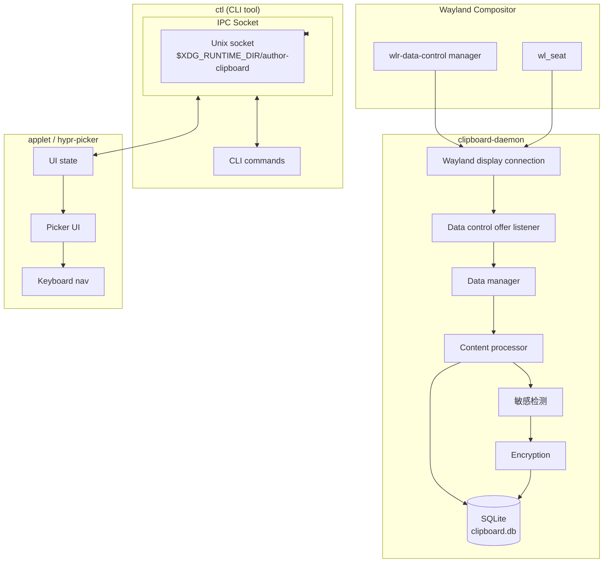

# Architecture

> System design and component overview for author-clipboard.

---

## System Overview

author-clipboard is a privacy-focused clipboard manager for COSMIC desktop and wlroots compositors (Hyprland, Sway). It captures clipboard changes via Wayland protocols, stores history in SQLite, and provides a picker UI for selecting and restoring items.

---

## Component Architecture



---

## Crates

### clipboard-daemon

**Responsibility**: Wayland clipboard monitoring, content processing, database storage.

**Key modules**:
- `wayland.rs` — Display connection, registry handling, data-control protocol
- `content.rs` — Content type detection, hash computation, dedup
- `sensitive.rs` — Sensitive content detection patterns
- `encryption.rs` — AES-256-GCM encryption/decryption
- `ipc.rs` — Unix socket server, command handling
- `db/` — Database operations (shared with other crates via `shared`)

**Public API** (via IPC):
- `toggle` — Show/hide picker
- `show` — Show picker
- `hide` — Hide picker
- `ping` — Health check
- `history` — List clipboard items
- `status` — Database statistics
- `clear` — Clear unpinned items
- `export` — JSON export
- `config` — Show current config

### applet

**Responsibility**: libcosmic popup UI for COSMIC desktop.

**Key modules**:
- `main.rs` — Application entry, layer-shell setup
- `ui/` — Widget tree (list, search, tabs)
- `theme.rs` — COSMIC theming integration
- `keyboard.rs` — Keyboard navigation handling

**Features**: Search, pin/delete, emoji picker, symbol picker, kaomoji picker, settings tab.

### shared

**Responsibility**: Shared types, database schema, configuration, image store.

**Key modules**:
- `db/` — Schema, migrations, CRUD operations
- `config.rs` — JSON config file handling
- `types.rs` — `ClipboardItem`, `ContentType`, `Config` structs
- `image_store.rs` — Image file storage and thumbnail generation
- `picker.rs` — Shared picker logic for CLI and GTK picker
- `screen_lock.rs` — Screen lock detection via loginctl/D-Bus

### ctl

**Responsibility**: CLI tool (`author-clipboard-ctl`).

**Commands**: toggle, show, hide, ping, history, status, clear, export, config, picker, hyprland-config.

### hypr-picker

**Responsibility**: Standalone GTK4 layer-shell native picker for Hyprland.

**Key modules**:
- `main.rs` — GTK4 app, layer-shell window
- `picker.rs` — Picker UI using shared picker logic

---

## Data Flow

### Capture Flow

1. Wayland compositor emits `wlr-data-control` clipboard change
2. Daemon receives offer via `data_control_device_v1::offer` event
3. Content read via `wl_data_offer::receive` → `wl_data_device::selection`
4. Content type detected (text/image/html/files/uri-list)
5. Hash computed for deduplication
6. Sensitive content detection runs
7. If sensitive + encryption enabled → encrypt content
8. Insert/update in SQLite

### Restore Flow

1. User selects item in picker UI
2. UI sends `copy <item_id>` via IPC to daemon
3. Daemon retrieves item from database
4. If encrypted → decrypt
5. Write content to Wayland clipboard via `wl_data_device::set_selection`
6. Target application pastes via standard Ctrl+V

---

## Database Schema

```sql
-- Main clipboard items
CREATE TABLE clipboard_items (
    id INTEGER PRIMARY KEY,
    content_hash BLOB NOT NULL,
    content_type TEXT NOT NULL,  -- 'text', 'image', 'html', 'files'
    content_data BLOB NOT NULL,  -- encrypted if sensitive
    plain_text TEXT,             -- FTS5 search indexing
    timestamp INTEGER NOT NULL,
    source_app TEXT,
    pinned BOOLEAN DEFAULT FALSE,
    mime_type TEXT,
    file_size INTEGER,
    encrypted BOOLEAN DEFAULT FALSE,
    expires_at INTEGER           -- TTL, NULL = never
);

-- FTS5 virtual table for full-text search
CREATE VIRTUAL TABLE clipboard_fts USING fts5(
    plain_text,
    content='clipboard_items',
    content_rowid='id'
);

-- Indexes
CREATE INDEX idx_timestamp ON clipboard_items(timestamp DESC);
CREATE INDEX idx_content_hash ON clipboard_items(content_hash);
CREATE INDEX idx_pinned ON clipboard_items(pinned);
CREATE INDEX idx_expires ON clipboard_items(expires_at) WHERE expires_at IS NOT NULL;
```

---

## IPC Protocol

**Socket path**: `$XDG_RUNTIME_DIR/author-clipboard` (fallback: `<cache_dir>/author-clipboard`)

**Format**: JSON lines

**Request**:
```json
{"cmd": "history", "args": {"limit": 50, "offset": 0}}
```

**Response**:
```json
{"ok": true, "data": [...], "error": null}
```

**Error response**:
```json
{"ok": false, "data": null, "error": "ITEM_NOT_FOUND"}
```

---

## Security Architecture

| Layer | Protection |
|-------|------------|
| Clipboard capture | Wayland compositor controls access via protocol |
| Sensitive detection | Pattern matching for passwords, keys, tokens, secrets |
| Encryption | AES-256-GCM with per-item nonce, key in 0600 file |
| IPC socket | Private directory (0700), socket in `$XDG_RUNTIME_DIR` |
| Screen lock | `loginctl` or D-Bus `org.freedesktop.ScreenSaver` triggers clear |
| Incognito | `.incognito` flag file pauses capture |

---

## Content Type Handling

| Type | Capture | Store | Restore |
|------|---------|-------|---------|
| Text | `text/plain` | Plain text | `wl-copy --type text/plain` |
| HTML | `text/html` | HTML + plain text fallback | `wl-copy --type text/html` |
| Image | `image/*` | File in `images/` + thumbnail | `wl-copy --type <mime>` |
| Files | `text/uri-list` | Parsed file metadata | `wl-copy --type text/uri-list` |

---

## Platform Support Matrix

| Environment | Clipboard Capture | UI |
|-------------|-------------------|-----|
| COSMIC | `COSMIC_DATA_CONTROL_ENABLED=1` | libcosmic applet |
| Hyprland | `wlr-data-control` | `ctl picker` (external) or `hypr-picker` (native) |
| Sway | `wlr-data-control` | libcosmic applet |
| Other wlroots | Maybe | libcosmic applet |
| X11 | Not implemented | Not implemented |
| GNOME/KDE | Not supported | Not supported |

---

## Configuration

**Path**: `~/.config/author-clipboard/config.json`

```json
{
  "max_items": 100,
  "max_item_size": 1048576,
  "data_dir": "~/.local/share/author-clipboard",
  "ttl_seconds": 604800,
  "cleanup_interval_seconds": 300,
  "encrypt_sensitive": false,
  "clear_on_lock": true,
  "dedup_window_seconds": 2,
  "mime_denylist": ["application/x-kde-cutselection"],
  "content_regex_denylist": [],
  "picker": {
    "default_mode": "external",
    "default_source": "history",
    "max_results": 50
  }
}
```

---

## Dependencies

| Crate | Version | Purpose |
|-------|---------|---------|
| `wayland-client` | workspace | Wayland protocol bindings |
| `wayland-protocols` | workspace | Wayland protocol definitions |
| `wayland-protocols-wlr` | workspace | wlr-data-control protocol |
| `rusqlite` | workspace | SQLite with bundled compile |
| `tokio` | workspace | Async runtime |
| `libcosmic` | git | COSMIC UI toolkit |
| `aes-gcm` | workspace | AES-256-GCM encryption |
| `serde` | workspace | Serialization |
| `tracing` | workspace | Structured logging |

---

**Last Updated**: Phase 14 Complete (v0.5.0)